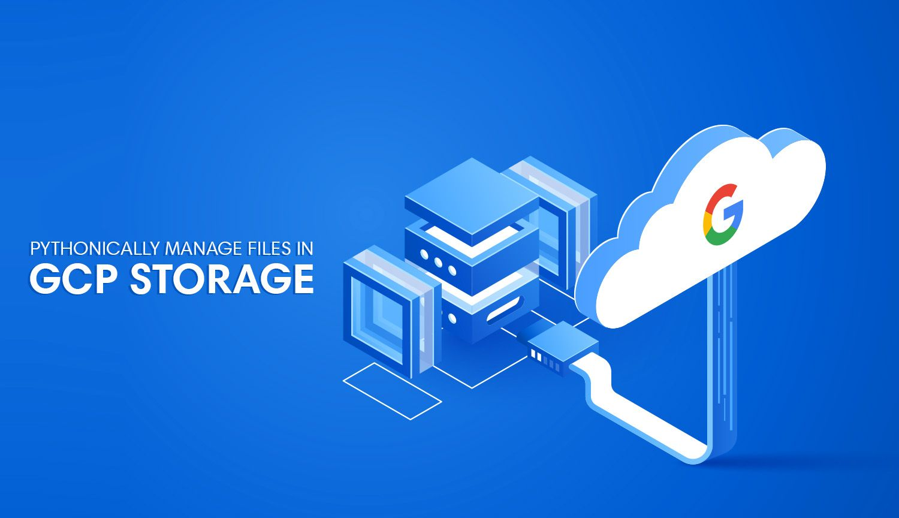

# Google Cloud Storage Python SDK Tutorial


[](https://github.com/hackersandslackers/googlecloud-storage-tutorial/issues)
[](https://github.com/hackersandslackers/googlecloud-storage-tutorial/stargazers)
[](https://github.com/hackersandslackers/googlecloud-storage-tutorial/network)



Source for the accompanying tutorial here: [https://hackersandslackers.com/google-cloud-storage-with-python/](https://hackersandslackers.com/google-cloud-storage-with-python/)

## Getting Started

Get set up locally in two steps:

### Environment Variables

Replace the values in **.env.example** with your values and rename this file to **.env**:

* `GCP_BUCKET_URL`: URL of your Google Cloud Storage bucket.
* `GCP_BUCKET_NAME`: Name of your Google Cloud Storage bucket.
* `GCP_BUCKET_FOLDER_NAME`: Directory within your bucket to store and modify files.
* `GOOGLE_APPLICATION_CREDENTIALS`: Path to your Google Cloud Platform service account key file.

### Installation

Get up and running with `make run`:

```shell
git clone https://github.com/hackersandslackers/googlecloud-storage-tutorial.git
cd googlecloud-storage-tutorial
make run
```

-----

**Hackers and Slackers** tutorials are free of charge. If you found this tutorial helpful, a [small donation](https://www.buymeacoffee.com/hackersslackers) would be greatly appreciated to keep us in business. All proceeds go towards coffee, and all coffee goes towards more content.
